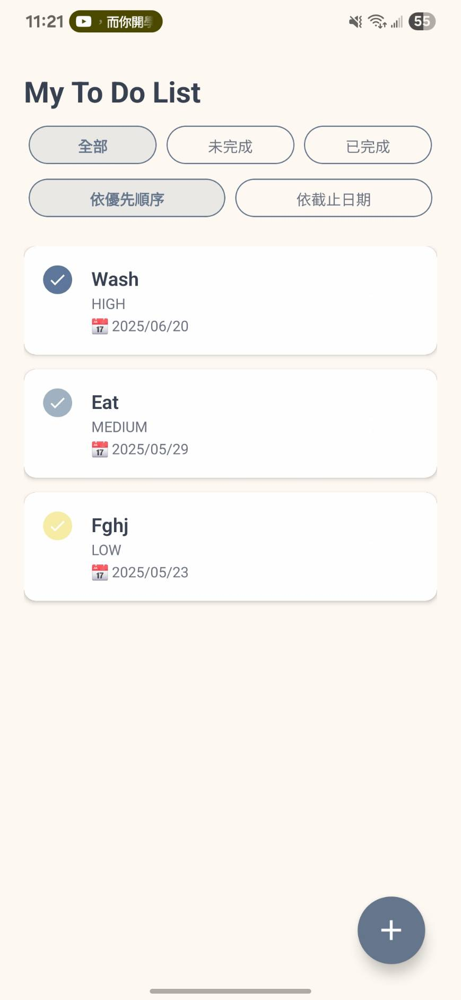
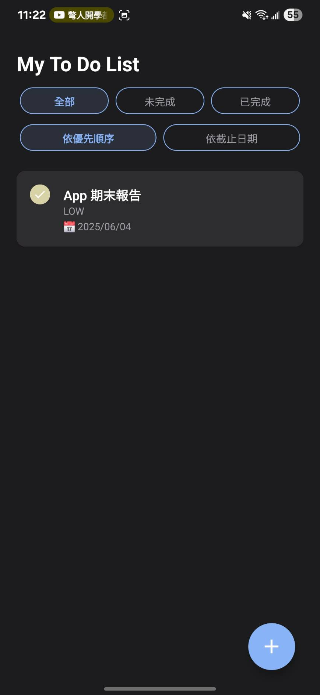
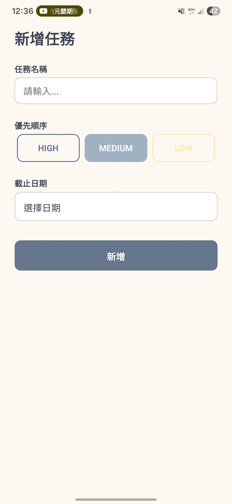
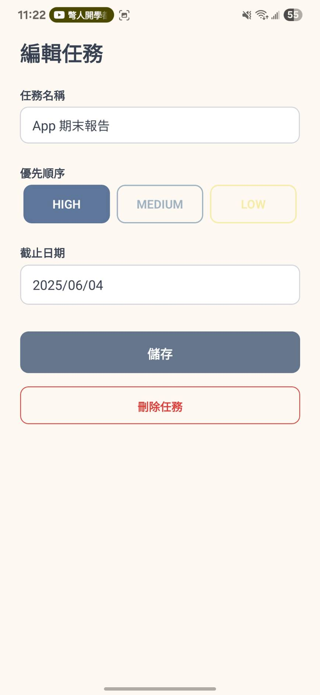

# MyToDo | React Native 任務清單 App

一款支援主題切換、任務分類、優先順序與截止日期的美感任務管理 App。  
使用 Expo + SQLite 開發，具備簡潔互動與一致視覺體驗。

---

## ✨ 特色功能

- ✅ 任務新增 / 編輯 / 刪除 / 勾選完成
- 🔁 支援排序（依優先順序 / 截止日期）
- 🧩 任務分類：全部 / 未完成 / 已完成
- 📅 任務可選擇截止日期
- 🌙 支援深色 / 淺色主題（自動切換）
- 🖌 主題色：柔和藍灰系搭配膠囊按鈕
- 🧠 使用 SQLite 儲存，資料持久化
- ⚙️ 打勾動畫、分類視覺動態反饋

---

## 🖼 畫面預覽

| 主頁面 | 深色模式 | 新增任務 | 編輯任務 |
|--------|----------|----------|----------|
|  |  |  |  |


---
## 🙋‍♀️ 開發過程中的挑戰與解法

### 1. SQLite 資料庫設定問題
一開始使用 `expo-sqlite` 進行資料儲存時，遇到了 TypeScript 類型錯誤與新版 API 不相容的問題。例如 `openDatabase` 無法正確匯入、`execAsync` 的用法與文件不一致。我後來閱讀了 expo-sqlite 的 changelog，並測試各種寫法，最終成功透過 `openDatabaseSync` 配合 `execAsync` 正確初始化資料庫。

### 2. 編輯與路由動態傳值困難
在實作編輯頁面 `/edit/[id].tsx` 時，原本無法順利取得該任務的 ID 與資料，導致畫面空白或報錯。我調整了 router 的 useLocalSearchParams 並手動定義 Task 類型，並學會使用 `find(t => String(t.id) === String(id))` 避免型別不一致問題。

### 3. GitHub Actions 自動打包卡關
我希望將 APK 自動化產出，但一開始在 GitHub Actions 上完全沒反應。後來我建立了 `.github/workflows/eas-build.yml` 檔案，學習使用 EAS CLI 與 Expo Token，並將 secret 加入 GitHub，才讓打包成功自動觸發。最後也成功取得 APK 安裝檔。

### 4. UI 設計與主題一致性
為了讓 UI 更好看，我參考了柔和藍灰配色設計任務列表與按鈕樣式，但在顏色過深或過亮之間來回調整了很多次。我嘗試將圓圈按鈕、膠囊分類按鈕都統一風格，並使用動畫增強互動感，讓整體視覺與操作更加一致。

---

## 💡 總結心得

雖然這次專案有不少技術細節要克服，從 SQLite 到 GitHub Actions 都需要查文件、debug，甚至換過開發環境（WSL），但也讓我對 React Native 的整合應用與前後端資料處理有更深的理解。完成後看到 APK 成功產出並能安裝，是一個很有成就感的學習過程。

---

## 🛠 技術棧

- [React Native](https://reactnative.dev/) with [Expo](https://expo.dev/)
- SQLite 本地資料庫（透過 `expo-sqlite`）
- `expo-router` 作為路由系統
- `react-native-reanimated` 實作動畫
- `dayjs` 處理日期格式
- `@react-native-community/datetimepicker` 作為日期選擇器
- `react-native-swipe-list-view` 實作滑動刪除

---

## 🚀 快速開始
📦 [點此下載 APK 安裝檔](https://expo.dev/accounts/asher31892774/projects/MyTodoApp/builds/133d6df8-d529-4cda-ad56-1e7c4dde4a2b)

### 📦 安裝依賴

```bash
npm install
npx expo install expo-sqlite react-native-reanimated @react-native-community/datetimepicker react-native-swipe-list-view dayjs
```

---

# Default Welcome to your Expo app 👋

This is an [Expo](https://expo.dev) project created with [`create-expo-app`](https://www.npmjs.com/package/create-expo-app).

## Get started

1. Install dependencies

   ```bash
   npm install
   ```

2. Start the app

   ```bash
   npx expo start
   ```

In the output, you'll find options to open the app in a

- [development build](https://docs.expo.dev/develop/development-builds/introduction/)
- [Android emulator](https://docs.expo.dev/workflow/android-studio-emulator/)
- [iOS simulator](https://docs.expo.dev/workflow/ios-simulator/)
- [Expo Go](https://expo.dev/go), a limited sandbox for trying out app development with Expo

You can start developing by editing the files inside the **app** directory. This project uses [file-based routing](https://docs.expo.dev/router/introduction).

## Get a fresh project

When you're ready, run:

```bash
npm run reset-project
```

This command will move the starter code to the **app-example** directory and create a blank **app** directory where you can start developing.

## Learn more

To learn more about developing your project with Expo, look at the following resources:

- [Expo documentation](https://docs.expo.dev/): Learn fundamentals, or go into advanced topics with our [guides](https://docs.expo.dev/guides).
- [Learn Expo tutorial](https://docs.expo.dev/tutorial/introduction/): Follow a step-by-step tutorial where you'll create a project that runs on Android, iOS, and the web.

## Join the community

Join our community of developers creating universal apps.

- [Expo on GitHub](https://github.com/expo/expo): View our open source platform and contribute.
- [Discord community](https://chat.expo.dev): Chat with Expo users and ask questions.

